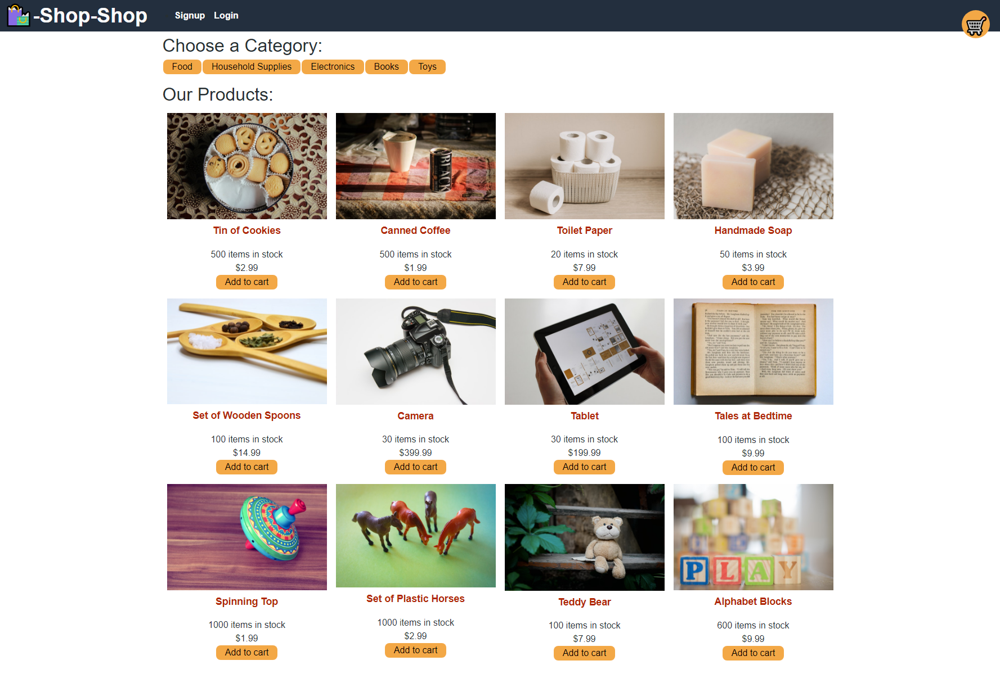
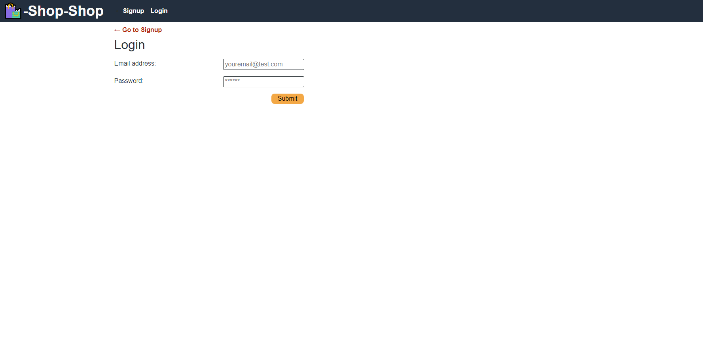
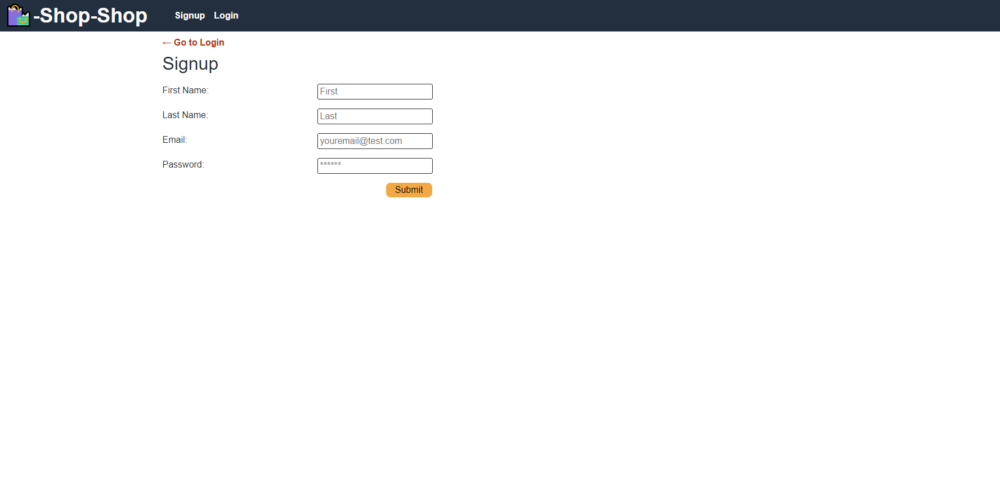

## E-Commerce Redux

<h2> Table of Contents </h2>

- [Project Link](#project-link)
- [Description](#description)
- [User Story](#user-story)
- [What did we do](#what-did-we-do)
- [Screenshots](#screenshots)

## Project Link

Click [here](https://github.com/PDUBB3/ecommerce-redux.git) to view project on Github repository.
Click [here](https://fierce-plateau-42457.herokuapp.com/) to view project on Heroku

## Description

In this project, I have refactored the e-commerce platform so it uses Redux.

## User Story

As a senior engineer working on an e-commerce platform
I want my platform to use Redux to manage global state instead of the Context API, so that my website's state management is taken out of the React ecosystem

## What did we do?

I have created a Redux store where I am able to do the following:

- [x] When I review the app’s store, then I find that the app uses a Redux store instead of the Context API
- [x] When I review the way the React front end accesses the store, then I find that the app uses a Redux provider
- [x] When I review the way the app determines changes to its global state, then I find that the app passes reducers to a Redux store instead of using the Context API
- [x] When I review the way the app extracts state data from the store, then I find that the app uses Redux instead of the Context API
- [x] When I review the way the app dispatches actions, then I find that the app uses Redux instead of the Context API

## Getting started

- Create a new GitHub repository called ecommerce-redux
- Clone github project onto your local machine
- Navigate into the project
- Open the project into VS code

```
git clone git@github.com:PDUBB3/ecommerce-redux.git
cd readme-generator
code .
```

## Screenshots

### Homepage



### Login form



### Sign up Page



```

```
